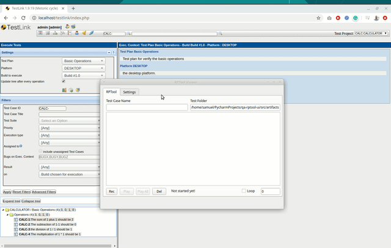

# QA-RPTOOL-UI

Record and Playback tool for Software Testing Automation Integrated with Testlink (POC).

### Installation

> python3 -m venv env

> source venv/bin/activate

> pip3 install -r requirements.txt

### Running the application

> python3 src/rptool.py

### Running the Tests
> cd src

>> python -m unittest discover -s tests
